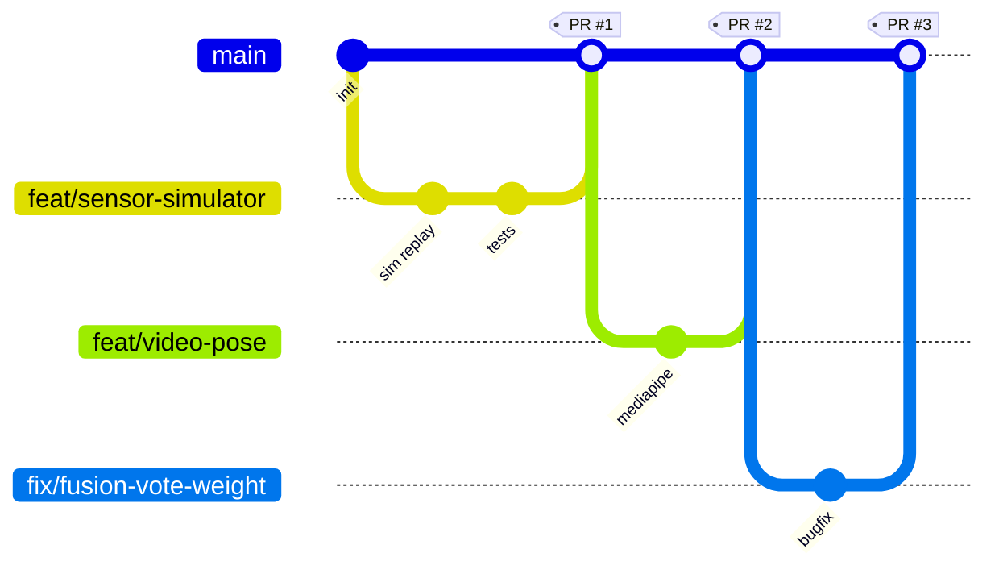

# Git Branching Strategy
## Multi-Modal Human Activity Recognition System for Patient Monitoring

| Field | Value |
|---|---|
| **Project** | HAR System for Patient Monitoring and Personalized Health Feedback with Multi-Modal Data |
| **Type** | College Final-Year Project |
| **Team** | Ankit Raj, Suman Kumar Jha, Tanzeem Shahzada, Aman Kumar |
| **Document** | Git Branching & Collaboration Strategy (how we work together on code) |
| **Version** | 1.0 |
| **Companion docs** | `core_docs/FUNCTIONAL_SPEC.md`, `core_docs/TECHNICAL_DESIGN.md` |

> This document defines how the 4-person team uses Git and GitHub: which branches exist, how features
> flow into `main`, naming rules, commit conventions, pull-request and review process, and how this maps
> onto the six microservices and the roadmap in the TDD. Keep it simple — this is a small,
> co-located student team, not a 50-engineer org.

---

## 1. Goals & Principles

- **`main` is always working.** Anyone (including the examiner) can clone `main` and run
  `docker compose up` from a fresh checkout. Broken code never lives on `main`.
- **One feature = one branch = one pull request.** Small, reviewable units.
- **No direct commits to `main`.** Everything lands through a reviewed PR.
- **Microservice ownership.** Each of the six services has a primary owner, so branches rarely
  conflict — the team works in parallel on independent service folders.
- **Lightweight, not heavy.** We use a trimmed **GitHub Flow** model (single long-lived branch +
  short-lived feature branches), *not* full Git Flow with `develop`/`release`/`hotfix`. A 4-person
  semester project does not need that overhead.

---

## 2. Branch Model

We use **GitHub Flow** (one permanent branch + short-lived branches):



### 2.1 Permanent branch

| Branch | Purpose | Rules |
|---|---|---|
| `main` | Single source of truth. Always runnable & demo-ready. | Protected. No direct pushes. Merge only via reviewed PR with green CI. |

> **Optional:** If you want a staging buffer before demos, you *may* add a `develop` branch later.
> For now we deliberately keep only `main` to reduce merge ceremony.

### 2.2 Short-lived working branches

All work happens on a branch cut **from the latest `main`**, then merged back via PR and **deleted**.

| Prefix | Use for | Example |
|---|---|---|
| `feat/` | A new feature or service capability | `feat/fusion-fall-detection` |
| `fix/` | A bug fix | `fix/mqtt-reconnect-loop` |
| `docs/` | Documentation only | `docs/branching-strategy` |
| `chore/` | Tooling, deps, CI, formatting, repo setup | `chore/docker-compose-setup` |
| `refactor/` | Internal change, no behavior change | `refactor/sensor-feature-extractor` |
| `test/` | Adding or improving tests only | `test/fusion-voting-cases` |
| `exp/` | Throwaway experiment / spike (may never merge) | `exp/yolo-vs-mediapipe` |

---

## 3. Branch Naming Convention

```
<type>/<service-or-area>-<short-description>
```

- **lowercase**, words separated by **hyphens** (kebab-case).
- Keep it short but descriptive (≤ ~5 words).
- Optionally append a tracking number if you use GitHub Issues: `feat/sensor-simulator-#12`.

**Service / area keywords** (aligns with the microservices in the TDD):

| Keyword | Service / area |
|---|---|
| `sensor` | Sensor Service (features + pre-trained HF HAR model) |
| `video` | Video Service (MediaPipe Pose) |
| `fusion` | Fusion / HAR Service (voting + fall logic) |
| `feedback` | Feedback Service (Ollama local LLM) |
| `auth` | Supabase authentication, JWT gateway, and RBAC |
| `dashboard` | Dashboard / UI |
| `sim` | Sensor simulator (dataset replay) |
| `broker` / `infra` | Mosquitto, Docker, PostgreSQL, compose |
| `shared` | Shared contracts / schemas |
| `docs` | Documentation |

**Good examples**

```
feat/video-pose-landmarks
feat/feedback-ollama-prompt
fix/sensor-window-overlap
chore/infra-mosquitto-config
docs/functional-spec-update
```

---

## 4. Service Ownership (parallel work map)

Each member owns one or two services as **primary**, reducing branch conflicts. Owners review PRs that
touch their area. (Adjust the assignments to match the team's actual division.)

| Service / area | Primary owner | Backup |
|---|---|---|
| Sensor Service + Simulator | _TBD_ | _TBD_ |
| Video Service | _TBD_ | _TBD_ |
| Fusion / HAR Service | _TBD_ | _TBD_ |
| Feedback Service (Ollama) | _TBD_ | _TBD_ |
| Auth Service + Supabase | _TBD_ | _TBD_ |
| Dashboard + Infra (Docker/MQTT/DB) | _TBD_ | _TBD_ |

> Fill in the four names (Ankit, Suman, Tanzeem, Aman) once the team agrees. Each member should be a
> **primary** on at least one service and a **backup reviewer** on another.

---

## 5. Daily Workflow (the loop every member follows)

```bash
# 1. Start from a fresh, up-to-date main
git checkout main
git pull origin main

# 2. Create your working branch
git checkout -b feat/video-pose-landmarks

# 3. Work in small commits (see commit convention below)
git add .
git commit -m "feat(video): emit normalized pose landmarks over MQTT"

# 4. Keep your branch fresh while you work (avoid big end-of-week merges)
git fetch origin
git rebase origin/main        # or: git merge origin/main if rebase feels risky

# 5. Push and open a Pull Request
git push -u origin feat/video-pose-landmarks
#   -> open PR on GitHub, request a reviewer

# 6. After approval + green CI: Squash & Merge, then delete the branch
git checkout main
git pull origin main
git branch -d feat/video-pose-landmarks
```

---

## 6. Commit Message Convention (Conventional Commits)

```
<type>(<scope>): <short summary in imperative mood>
```

- **type**: `feat`, `fix`, `docs`, `chore`, `refactor`, `test`, `perf`.
- **scope** (optional): the service/area keyword from §3 (`sensor`, `video`, `fusion`, …).
- **summary**: imperative ("add", "fix", not "added"/"fixes"), lowercase, no trailing period, ≤ ~72 chars.

**Examples**

```
feat(fusion): add confidence-weighted voting across modalities
fix(sensor): correct sliding-window overlap off-by-one
docs(core): add git branching strategy
chore(infra): pin mosquitto and python image versions
test(fusion): cover fall-detection edge cases
```

Body (optional) explains **why**, not what. Reference issues: `Closes #12`.

---

## 7. Pull Request (PR) Process

1. **Open early.** Draft PRs are welcome for work-in-progress to get feedback.
2. **Keep PRs small** — ideally one service capability. Easier to review before exams.
3. **Self-checklist before requesting review** (put this in the PR description):
   - [ ] Branch is rebased on the latest `main`.
   - [ ] Code runs locally (`docker compose up` or the service's run command).
   - [ ] Tests added/updated and passing.
   - [ ] No secrets, datasets, or large binaries committed (see `.gitignore`).
   - [ ] Linked to the relevant FSD/TDD requirement (`FR-*`, `NFR-*`) where applicable.
4. **At least 1 approval required** before merge. For changes to `shared/` contracts, get **2 approvals**
   (they affect every service).
5. **CI must be green** (see §9).
6. **Merge method: Squash & Merge** — keeps `main` history clean (one commit per feature).
7. **Delete the branch** after merge.

### PR title format
Same as commit convention: `feat(video): emit pose landmarks over MQTT`.

---

## 8. Handling Conflicts & Shared Contracts

- The `shared/` folder (MQTT topics, JSON message schemas) is the highest-risk shared surface.
  - Changes here need **2 reviewers** and a heads-up to the team **before** merging.
  - Announce contract changes in the team chat so others rebase promptly.
- Resolve conflicts **on your branch** (`git rebase origin/main`), never by force-pushing `main`.
- If a rebase gets messy, fall back to `git merge origin/main` — correctness over clean history.

---

## 9. Continuous Integration (GitHub Actions)

A minimal CI runs on every PR and every push to `main`:

| Check | Tool | Blocks merge? |
|---|---|---|
| Lint / format | `ruff` / `black --check` | Yes |
| Unit tests | `pytest` | Yes |
| Build images | `docker compose build` | Yes (on `main` at least) |

> Keep CI fast (< a few minutes) so it does not slow down the team. Heavy model downloads should be
> cached or mocked in tests, not run on every PR.

---

## 10. Branch Protection Rules (configure on GitHub)

Set these on `main` under **Settings → Branches → Branch protection rules**:

- ✅ Require a pull request before merging.
- ✅ Require **1 approval** (2 for `shared/`).
- ✅ Require status checks (CI) to pass before merging.
- ✅ Require branches to be up to date before merging.
- ✅ Require linear history (pairs well with Squash & Merge).
- ❌ Do **not** allow force pushes to `main`.
- ❌ Do **not** allow deletions of `main`.

---

## 11. Releases & Tags (for demo / submission milestones)

Tag meaningful milestones so they are easy to check out during evaluation:

```bash
git tag -a v0.1-phase3 -m "Sensor + simulator end-to-end"
git push origin v0.1-phase3
```

| Tag pattern | Meaning |
|---|---|
| `v0.x-phaseN` | End of roadmap Phase N (see TDD §roadmap) |
| `v1.0-demo` | Final demo-ready build for evaluation |
| `v1.0-submission` | Frozen state submitted to the college |

Optionally create a **GitHub Release** from `v1.0-submission` with a short summary and screenshots.

---

## 12. Mapping to the 10-Phase Roadmap

Each roadmap phase becomes one or more `feat/` branches → PRs. Example mapping:

| Roadmap phase | Typical branches |
|---|---|
| Repo skeleton & infra | `chore/infra-docker-compose`, `chore/broker-mosquitto-config`, `feat/shared-contracts` |
| Sensor service & simulator | `feat/sim-dataset-replay`, `feat/sensor-har-inference` |
| Video service | `feat/video-pose-landmarks`, `feat/video-activity-rules` |
| Fusion service | `feat/fusion-voting`, `feat/fusion-fall-detection` |
| Feedback service | `feat/feedback-ollama-prompt` |
| Dashboard | `feat/dashboard-timeline`, `feat/dashboard-alerts` |
| Hardening & demo | `test/*`, `fix/*`, `docs/*`, tag `v1.0-demo` |

---

## 13. Quick Reference (cheat sheet)

```bash
# new feature
git checkout main && git pull
git checkout -b feat/<area>-<desc>

# save work
git commit -m "feat(<area>): <imperative summary>"

# stay current
git fetch origin && git rebase origin/main

# publish + PR
git push -u origin HEAD

# after merge
git checkout main && git pull && git branch -d feat/<area>-<desc>
```

| Do | Don't |
|---|---|
| Branch from fresh `main` | Commit directly to `main` |
| Small, focused PRs | One giant end-of-semester PR |
| Rebase often | Let branches drift for weeks |
| Delete merged branches | Leave dozens of stale branches |
| Coordinate on `shared/` | Change contracts silently |

---

*End of Git Branching Strategy v1.0.*
