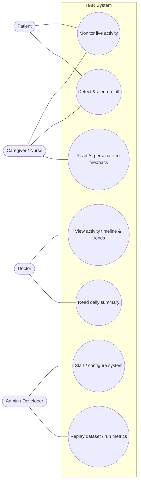

# Functional Specification Document (FSD)
## Multi-Modal Human Activity Recognition System for Patient Monitoring & Personalized Health Feedback

| Field | Value |
|---|---|
| **Project** | HAR System for Patient Monitoring and Personalized Health Feedback with Multi-Modal Data |
| **Type** | College Final-Year Project |
| **Team** | Ankit Raj, Suman Kumar Jha, Tanzeem Shahzada, Aman Kumar |
| **Document** | Functional Specification Document (what the system does) |
| **Version** | 1.0 |
| **Status** | Approved for implementation |
| **Companion doc** | `core_docs/TECHNICAL_DESIGN.md` (how it is built) |

---

## 1. Overview

### 1.1 Purpose of this document
This Functional Specification Document (FSD) describes **what** the HAR System does from the point of
view of its users and stakeholders — features, behaviours, user interactions, inputs/outputs, and
acceptance criteria. It deliberately avoids implementation detail (code, libraries, data schemas),
which lives in the companion **Technical Design Document (TDD)**.

Anyone reading this document should be able to understand:
- The problem the system solves and for whom.
- Every feature the system must provide.
- How a user interacts with the system, screen by screen.
- The measurable conditions under which each feature is considered "done".

### 1.2 Product summary (one paragraph)
The HAR System is a **software application** that recognizes a patient's physical activities
(walking, sitting, standing, lying, exercising) and detects **falls** in real time by combining two
data sources — a **camera (webcam) pose stream** and a **wearable-sensor stream** — and then
produces **personalized, plain-language health feedback and alerts** using a local **Generative-AI
(GenAI) model**. Caregivers and doctors monitor everything through a **web dashboard**. The entire
system is built **only from free and open-source software and pre-trained models**; the team does
**not** train any model of its own.

### 1.3 Intended audience
- **Project team & evaluators** — to agree on scope and grade against acceptance criteria.
- **Developers** (the team itself in the build phase) — as the source of truth for required behaviour.
- **Demo viewers / faculty guide** — to understand capabilities and limitations.

### 1.4 Guiding constraints (non-negotiable)
1. **100% open-source / free.** No paid services, no cloud billing. (No Firebase/AWS/Thingspeak.)
2. **No custom model training.** Only **pre-trained, openly available models** are used for
   inference (MediaPipe Pose, a pre-trained HuggingFace HAR model, and a local GenAI LLM via Ollama).
3. **Software-only deployment.** Runs on a standard laptop. No physical IoT hardware is required;
   the wearable sensor stream is produced by a **simulator** that replays a public dataset.
4. **Privacy-first.** Raw camera frames are **never stored**; only numeric body-landmark data leaves
   the video component.

### 1.5 Glossary
| Term | Meaning |
|---|---|
| **HAR** | Human Activity Recognition — classifying what a person is doing. |
| **Multi-modal** | Using more than one data source (here: camera + sensor) for one decision. |
| **Modality** | A single data source/channel (e.g., the "video modality"). |
| **Pose estimation** | Detecting body joint positions ("landmarks") from an image. |
| **Landmark** | A single tracked body point (e.g., left shoulder) as (x, y, z, visibility). |
| **IMU** | Inertial Measurement Unit — accelerometer + gyroscope (e.g., MPU6050). |
| **Fusion** | Combining the two modalities' predictions into one final decision. |
| **Late fusion** | Each modality predicts separately; predictions are combined afterwards. |
| **Temporal smoothing** | Using recent history to prevent the label flickering frame-to-frame. |
| **GenAI / LLM** | Generative AI Large Language Model that writes the natural-language feedback. |
| **Ollama** | Free tool that runs open-source LLMs locally on the laptop. |
| **MQTT** | Lightweight publish/subscribe messaging protocol used between services. |
| **Microservice** | An independent service responsible for one part of the system. |
| **Simulator** | Component that replays a recorded sensor dataset as if it were a live device. |
| **F1 score** | Accuracy metric balancing precision and recall (0–1, higher is better). |

---

## 2. Problem Statement & Objectives

### 2.1 Problem statement
Modern healthcare is shifting from reactive treatment to **continuous, preventive monitoring**, but
patients (especially the **elderly**, **post-surgery**, and **chronically ill**) cannot be observed
manually 24×7. Existing automated approaches are each individually weak:

- **Wearable-sensor-only systems** detect motion well but **cannot tell posture apart** (e.g.,
  *sitting* vs *standing*) and miss visual context.
- **Camera-only systems** read posture well but suffer from **lighting/occlusion** problems and
  **raise serious privacy concerns** when raw video is stored.
- Both produce **high false-alarm rates**, and **self-reported** activity data is unreliable.

**Core problem:** *How can we build a real-time, accurate, privacy-preserving activity-recognition
system for patients that also gives caregivers actionable, personalized feedback — using only free,
open-source, pre-trained technology?*

### 2.2 Objectives
| # | Objective |
|---|---|
| O1 | Recognize and classify patient activities — **walking, sitting, standing, lying, exercising** — in real time. |
| O2 | **Detect falls** reliably, with low false-positive rate. |
| O3 | **Fuse** sensor and video signals so combined accuracy beats either modality alone. |
| O4 | Generate **personalized, plain-language health feedback** and **alerts** using a local GenAI model. |
| O5 | Present live status, history, trends, and alerts on a **web dashboard** for caregivers/doctors. |
| O6 | Keep the whole system **open-source, free, privacy-preserving, and laptop-deployable**. |

### 2.3 Success criteria (project-level)
- Fusion model achieves a **higher activity F1 score** than either single modality on the demo dataset.
- Fall detection achieves **high precision and recall** with very few false positives.
- End-to-end latency is low enough to feel **real-time**.
- A live demo runs end-to-end on one laptop with **no paid service and no custom-trained model**.

---

## 3. Scope

### 3.1 In scope
- Real-time activity recognition from a **laptop webcam** (video modality).
- Real-time activity & fall signals from a **simulated wearable sensor** stream (sensor modality),
  produced by replaying a **public dataset**.
- **Multi-modal fusion** of the two modalities into a single activity decision + fall event.
- **GenAI-generated** personalized feedback, daily summaries, and natural-language alert messages.
- A **web dashboard** showing live activity, timeline/history, trends, and alerts.
- **Local persistence** of the activity timeline and events (so history and summaries work).
- A **metrics harness** to measure F1 / fall precision-recall / latency for the report.

### 3.2 Out of scope (explicitly)
- **Procuring or wiring physical IoT hardware** (ESP32/MPU6050/heart-rate sensor). An optional
  firmware path is *documented* in the TDD for future work but is **not built or required**.
- **Training, fine-tuning, or building any model.** Only pre-trained models are used.
- **Clinical/medical certification.** The system is an academic prototype and an assistive tool, not
  a diagnostic medical device.
- **Multi-patient / multi-camera tracking, telemedicine, and mobile apps** — listed under Future Scope.
- **Cloud hosting / paid infrastructure.**

### 3.3 Assumptions
- A laptop with a working **webcam** and **≥8 GB RAM** is available for the demo.
- The laptop can run a **small local LLM** (3B-class) via Ollama on CPU (slower) or GPU (faster).
- Internet is available **once** to download datasets, the pre-trained models, and the LLM weights;
  after that the system runs **fully offline**.
- A single patient is in frame for the camera modality during a demo.

### 3.4 Dependencies (all free/open-source — see TDD §2 for versions/licenses)
MediaPipe Pose, OpenCV, a pre-trained HuggingFace HAR model, Ollama (+ a small open LLM such as
Llama 3.2 3B / Qwen2.5 3B / Phi-3-mini), FastAPI, Mosquitto (MQTT), SQLite, React + Vite, Docker.

---

## 4. Stakeholders, Personas & User Stories

### 4.1 Personas
| Persona | Description | Goals | Pain today |
|---|---|---|---|
| **Patient** (monitored) | Elderly / post-surgery / chronically ill person being observed. | Stay safe; be helped quickly if they fall; keep some privacy. | Can't be watched 24×7; privacy fears about cameras. |
| **Caregiver / Nurse** | Family member or nurse responsible for the patient day-to-day. | Know the patient's current state at a glance; get instant fall alerts; see simple advice. | No continuous visibility; alert fatigue from false alarms. |
| **Doctor** | Reviews recovery/activity trends periodically. | See activity trends and abnormal events over time; get a concise summary. | Relies on unreliable self-reported activity. |
| **Admin / Developer** (the team) | Sets up and runs the system; tunes thresholds; runs the demo. | Easy local setup; observability; tunable rules; reproducible metrics. | Complex multi-service setups; closed/paid tools. |

### 4.2 User stories (representative)
**Patient**
- US-P1: As a patient, I want a fall to be detected automatically so help is alerted even if I can't move.
- US-P2: As a patient, I want the camera to keep only body-position data (not video) so my privacy is protected.

**Caregiver / Nurse**
- US-C1: As a caregiver, I want to see the patient's **current activity** live so I know their state at a glance.
- US-C2: As a caregiver, I want an **immediate, clearly-worded alert** when a fall is detected so I can respond fast.
- US-C3: As a caregiver, I want **plain-language advice** about the patient's activity pattern so I know what to do.
- US-C4: As a caregiver, I want **few false alarms** so I trust the alerts.

**Doctor**
- US-D1: As a doctor, I want an **activity timeline and trends** over hours/days so I can judge recovery.
- US-D2: As a doctor, I want a **concise daily summary** generated automatically so I save review time.

**Admin / Developer**
- US-A1: As a developer, I want to **start the whole system with one command** so demos are easy.
- US-A2: As a developer, I want to **replay a dataset** so the system works without any hardware.
- US-A3: As a developer, I want to **tune fall/activity thresholds via config** without code changes.
- US-A4: As a developer, I want to **measure F1/precision/recall/latency** so I can report results.

---

## 5. Recognized Activities & Events

### 5.1 Activity classes
The system classifies the patient's current activity into exactly one of:

| Code | Activity | Notes |
|---|---|---|
| `WALKING` | Walking / moving around | Dynamic motion. |
| `SITTING` | Sitting | Upright torso, low motion, hips bent. |
| `STANDING` | Standing | Upright torso, low motion, body vertical. |
| `LYING` | Lying down | Body roughly horizontal. |
| `EXERCISING` | Exercising | Repetitive vigorous motion. |
| `UNKNOWN` | Unclassifiable | Low confidence / person not in frame. |

### 5.2 Events
| Code | Event | Definition (functional) |
|---|---|---|
| `FALL` | Fall detected | A sudden high-motion spike **together with** the body transitioning to a horizontal orientation. |
| `INACTIVITY` | Prolonged inactivity | No meaningful activity change for a configurable period (e.g., lying still beyond a threshold). |
| `ABNORMAL_PATTERN` | Abnormal pattern | Activity pattern deviates from the recent baseline (e.g., unusually long lying during daytime). |

---

## 6. Functional Requirements

Requirements are grouped by the five microservices named in the architecture. Each requirement has
an ID, a description, a priority (**M**=Must, **S**=Should, **C**=Could), and **acceptance criteria**.

### 6.1 Sensor Service (FR-S)
| ID | Pri | Requirement | Acceptance criteria |
|---|---|---|---|
| FR-S1 | M | Ingest a continuous stream of wearable-sensor readings (accelerometer + gyroscope) from the simulator. | With the simulator running, the service receives and processes readings continuously without dropping the stream. |
| FR-S2 | M | Segment the stream into fixed time **windows** and compute summary **features** per window. | For each window, a feature set is produced and logged/forwarded. |
| FR-S3 | M | Classify each window into one of the activity classes using a **pre-trained model** (no training). | Each window yields one activity label **and** a confidence value (0–1). |
| FR-S4 | M | Publish the per-window prediction (label + confidence + timestamp) to the Fusion Service. | Fusion Service receives sensor predictions in order, tagged with time. |
| FR-S5 | S | Emit a motion-intensity signal usable by fall logic (e.g., acceleration magnitude spikes). | A high-motion window is flagged distinctly from a calm window. |
| FR-S6 | C | Fall back to a deterministic statistical/zero-shot classification if the pre-trained model is unavailable. | With the model disabled, the service still outputs labels via the fallback. |

### 6.2 Video Service (FR-V)
| ID | Pri | Requirement | Acceptance criteria |
|---|---|---|---|
| FR-V1 | M | Capture frames from the laptop **webcam** in real time. | The service runs against a live webcam and processes frames continuously. |
| FR-V2 | M | Run **pre-trained pose estimation** to detect body landmarks per frame. | Body landmarks are produced for frames where a person is visible. |
| FR-V3 | M | Derive posture features (joint angles, body orientation, vertical vs horizontal) from landmarks. | Posture features are computed and a posture label is produced per frame/window. |
| FR-V4 | M | Classify posture into the activity classes using **deterministic geometric rules** (no training). | Sitting/standing/lying/walking are distinguishable on a live demo. |
| FR-V5 | M | **Never store raw frames**; only numeric landmark/posture data leaves the service. | Inspection of stored data and outbound messages shows **no images**, only numbers. |
| FR-V6 | M | Publish per-window posture prediction (label + confidence + orientation + timestamp) to Fusion. | Fusion Service receives video predictions in order, tagged with time. |
| FR-V7 | S | Provide an orientation flag (e.g., "body horizontal") usable by fall logic. | A horizontal-body condition is reported when the person lies/falls. |
| FR-V8 | C | Degrade gracefully when no person is in frame (emit `UNKNOWN`, not a crash). | With an empty frame, the service emits `UNKNOWN` and keeps running. |

### 6.3 Fusion / HAR Service (FR-F)
| ID | Pri | Requirement | Acceptance criteria |
|---|---|---|---|
| FR-F1 | M | Combine time-aligned sensor and video predictions into **one final activity** per interval. | For each interval a single fused activity + confidence is produced. |
| FR-F2 | M | Use **confidence-weighted voting** so the more-confident modality has more influence. | When modalities disagree, the higher-confidence one wins (demonstrable in tests). |
| FR-F3 | M | Apply **temporal smoothing** to prevent rapid label flicker. | The fused label does not change on isolated single-window noise. |
| FR-F4 | M | Detect a **fall** using the combined rule: motion spike (sensor) **AND** horizontal body (video). | A simulated fall raises a `FALL` event; ordinary sitting/lying does **not**. |
| FR-F5 | M | Emit final activity updates and events to persistence + Feedback + Dashboard. | Downstream services and the dashboard reflect fused results in real time. |
| FR-F6 | S | Detect `INACTIVITY` and `ABNORMAL_PATTERN` from the fused timeline. | Prolonged stillness raises an inactivity event after the configured threshold. |
| FR-F7 | S | Be resilient to one modality being temporarily absent (use the available one). | If video drops, fusion continues on sensor only (and vice-versa). |

### 6.4 Feedback Service — GenAI (FR-G)
| ID | Pri | Requirement | Acceptance criteria |
|---|---|---|---|
| FR-G1 | M | Generate **personalized, plain-language feedback** from the recent activity timeline using a **local LLM**. | Given a timeline, the service returns readable, relevant advice text. |
| FR-G2 | M | Generate a **clear natural-language alert message** when a `FALL`/abnormal event occurs. | A fall event yields a concise, human-readable alert (who/what/when/severity). |
| FR-G3 | S | Generate a **daily/periodic summary** of the patient's activity. | On request/schedule, a coherent summary of the period is produced. |
| FR-G4 | M | Always include a **safety disclaimer** and avoid making medical diagnoses. | Generated text contains a disclaimer and gives general guidance, not diagnosis. |
| FR-G5 | M | Return feedback as **structured output** (so the dashboard can display fields reliably). | Output has predictable fields (e.g., headline, detail, severity, advice). |
| FR-G6 | S | Run **fully offline** after the model is downloaded. | With networking disabled, feedback generation still works. |

### 6.5 Dashboard Service (FR-D)
| ID | Pri | Requirement | Acceptance criteria |
|---|---|---|---|
| FR-D1 | M | Show the patient's **current activity** live. | The current activity updates within ~1–2 s of a change, without page reload. |
| FR-D2 | M | Show a **live banner/notification** when a fall/abnormal event occurs. | A fall event triggers a visible, unmistakable alert on screen. |
| FR-D3 | M | Show an **activity timeline / history** of recent activities. | The timeline lists past activities with timestamps and durations. |
| FR-D4 | M | Show **trends** (e.g., time spent per activity, activity over the day) as charts. | At least one chart visualizes activity distribution/over-time. |
| FR-D5 | M | Show the **GenAI feedback / summary** panel. | The latest AI feedback and (when available) summary are displayed. |
| FR-D6 | S | Show a **system/health panel** (which services/modalities are online). | The dashboard indicates if video or sensor stream is offline. |
| FR-D7 | C | Allow basic **acknowledgement** of an alert (mark as seen). | An acknowledged alert is visually distinguished from a new one. |

### 6.6 Cross-cutting / platform (FR-X)
| ID | Pri | Requirement | Acceptance criteria |
|---|---|---|---|
| FR-X1 | M | **Persist** the activity timeline and events locally so history/summaries survive restarts. | After restart, prior timeline/events are still visible. |
| FR-X2 | M | Provide a **simulator** that replays a public dataset over the sensor channel. | The system works end-to-end with the simulator and no hardware. |
| FR-X3 | M | Be **startable with one command** for the demo. | A single documented command brings up all services. |
| FR-X4 | S | Expose **configuration** (thresholds, window sizes, model names) without code edits. | Changing a config value changes behaviour on restart. |
| FR-X5 | S | Provide a **metrics harness** that computes F1 / precision / recall / latency on a labeled replay. | Running it prints the metrics used in the report. |

---

## 7. Use Cases

### 7.1 Use-case diagram (textual / Mermaid)

### 7.2 Detailed use cases

**UC-2: Detect & alert on fall** (primary safety case)
- **Actors:** Patient (trigger), Caregiver (receiver).
- **Precondition:** System running; webcam + sensor streams active.
- **Main flow:**
  1. The patient falls; the sensor stream shows a sudden motion spike.
  2. The video stream shows the body orientation becoming horizontal.
  3. Fusion combines both signals and raises a `FALL` event.
  4. The event is persisted; the Feedback Service produces a clear alert message.
  5. The Dashboard immediately shows a prominent fall alert.
- **Postcondition:** Fall event recorded; caregiver notified on screen.
- **Alternate flows:** Only one modality indicates a fall → treated as low-confidence; no hard alert
  (raises false-alarm protection). Person leaves frame → fusion uses sensor only.
- **Acceptance:** Simulated fall reliably raises exactly one alert; ordinary lying down does not.

**UC-1: Monitor live activity**
- **Actors:** Caregiver/Patient.
- **Flow:** Streams flow → Fusion produces current activity → Dashboard shows it live.
- **Acceptance:** A change of activity in the demo is reflected on the dashboard within ~1–2 s.

**UC-4: Read AI personalized feedback**
- **Actors:** Caregiver.
- **Flow:** Caregiver opens the feedback panel → Feedback Service summarizes recent activity via the
  local LLM → returns advice with a disclaimer → dashboard displays it.
- **Acceptance:** Feedback is readable, relevant to the recent timeline, and contains a disclaimer.

**UC-7: Replay dataset / run metrics**
- **Actors:** Admin/Developer.
- **Flow:** Developer runs the simulator on a labeled dataset → system processes it → metrics harness
  compares predictions to ground-truth labels → prints F1/precision/recall/latency.
- **Acceptance:** Metrics are produced and reproducible across runs.

---

## 8. Dashboard Screens & UX Flows

### 8.1 Screen inventory
| Screen | Purpose | Key elements |
|---|---|---|
| **Live Monitor (home)** | At-a-glance current state. | Big "current activity" card; live status dot; fall-alert banner; mini activity feed. |
| **Activity Timeline** | History of activities. | Chronological list / timeline bar with timestamps & durations; filter by time range. |
| **Trends & Insights** | Patterns over time. | Charts: time-per-activity (pie/bar), activity-over-time; key stats (active vs resting time). |
| **AI Feedback** | GenAI output. | Personalized feedback card; daily summary; severity badge; disclaimer footer. |
| **Alerts** | Event log. | List of fall/abnormal/inactivity events with time & status; acknowledge action (Could). |
| **System Health** | Operational view. | Online/offline state per modality & service; last-updated timestamps. |

### 8.2 Primary UX flow (caregiver, happy path)
1. Open dashboard → **Live Monitor** shows current activity and a green "all systems online" dot.
2. Patient falls → a **red fall banner** appears at the top with a generated alert message.
3. Caregiver clicks the banner → jumps to **Alerts**, sees event detail and AI advice.
4. Later, caregiver opens **AI Feedback** to read the daily summary.

### 8.3 UX principles
- **Glanceability:** current state readable from across a room (large type, color-coded).
- **Alarm clarity:** fall alerts are visually dominant and unambiguous; non-critical info is quieter.
- **Trust:** show modality/health status so users know the data is live; few false alarms by design.
- **Plain language:** all AI text in simple, non-technical wording.

---

## 9. Non-Functional Requirements (NFR)

| ID | Category | Requirement | Target / acceptance |
|---|---|---|---|
| NFR-1 | **Real-time latency** | End-to-end delay from event to dashboard should feel real-time. | Target **< 1 s** for activity updates; fall alert appears within ~1–2 s. |
| NFR-2 | **Recognition accuracy** | Fusion must beat single modalities on the demo dataset. | Fusion **F1 > each single-modality F1**; fall precision & recall both high (target ≥ ~0.9). |
| NFR-3 | **Privacy** | No raw video persisted; only landmark/numeric data leaves the video service. | Audit shows zero stored images; messages carry numbers only. |
| NFR-4 | **Reliability** | One modality or service failing must not crash the system. | With video off, system still recognizes via sensor (and vice-versa). |
| NFR-5 | **Usability** | A non-technical caregiver can read current state & alerts without training. | Usability walkthrough: caregiver identifies state & a fall unaided. |
| NFR-6 | **Portability / Deployability** | Runs on a standard laptop; one-command start. | `docker-compose up` (documented) brings up the full system. |
| NFR-7 | **Cost / licensing** | Only free, open-source components and openly-licensed models. | Dependency audit shows no paid/closed component. |
| NFR-8 | **Offline operation** | After initial downloads, runs without internet. | Full demo runs with networking disabled. |
| NFR-9 | **Maintainability** | Microservice isolation; config-driven thresholds. | Thresholds/models changeable via config, not code. |
| NFR-10 | **Observability** | Each service logs its activity for debugging/demo. | Logs show inbound data, predictions, and events per service. |
| NFR-11 | **Safety of AI output** | GenAI must not provide diagnoses; always disclaim. | Generated text includes disclaimer; no diagnostic claims. |

---

## 10. Constraints, Risks & Mitigations (functional view)

| Risk | Impact | Mitigation |
|---|---|---|
| Webcam posture rules misread unusual poses. | Wrong activity label. | Fusion + temporal smoothing; confidence gating; tune rule thresholds via config. |
| Local LLM is slow on a CPU-only laptop. | Feedback feels laggy. | Use a small 3B model; generate feedback on-demand/periodically, not per frame. |
| Pre-trained HAR model labels don't perfectly match our class set. | Mismatched sensor labels. | Map model labels to our class set; statistical/zero-shot fallback (FR-S6). |
| False fall alarms erode trust. | Alert fatigue. | Require **both** modalities for high-confidence fall; temporal smoothing. |
| No real hardware → "IoT" story is simulated. | Evaluator questions realism. | Document optional ESP32 firmware path; emphasize identical software pipeline. |

---

## 11. Acceptance & Demo Checklist

The project is considered functionally complete when **all "Must" requirements pass** and the
following live demo succeeds on a single laptop, fully offline:

- [ ] One command starts all five services + simulator + dashboard.
- [ ] Dashboard shows **live current activity** that changes as the person on webcam changes posture.
- [ ] Simulator replay drives the **sensor modality**; both modalities are shown "online".
- [ ] A **simulated/acted fall** raises exactly one **fall alert** on the dashboard within ~1–2 s.
- [ ] Ordinary **sitting/lying** does **not** raise a fall alert (false-alarm control).
- [ ] **AI feedback** panel shows relevant, plain-language advice **with a disclaimer**.
- [ ] **Daily summary** generates a coherent recap of the session.
- [ ] **Timeline & trend** views populate from persisted history.
- [ ] Turning the **webcam off** does not crash the system (sensor-only continues).
- [ ] **Metrics harness** prints F1 / fall precision-recall / latency, and **fusion F1 > single-modality F1**.
- [ ] Dependency audit confirms **no paid service and no custom-trained model**.

---

## 12. Traceability (objectives → requirements)

| Objective | Satisfied by |
|---|---|
| O1 Recognize activities | FR-S1–S4, FR-V1–V6, FR-F1–F3, FR-D1, FR-D3 |
| O2 Detect falls | FR-S5, FR-V7, FR-F4, FR-G2, FR-D2 |
| O3 Multi-modal fusion beats single | FR-F1–F3, FR-F7, NFR-2, FR-X5 |
| O4 GenAI personalized feedback | FR-G1–G6, FR-D5 |
| O5 Dashboard for caregivers/doctors | FR-D1–D7, FR-X1 |
| O6 Open-source / free / privacy / laptop | FR-V5, FR-X2–X4, NFR-3, NFR-6–NFR-8 |

---

*End of Functional Specification Document. Implementation details (architecture, data schemas, APIs,
algorithms, setup, testing) are specified in `core_docs/TECHNICAL_DESIGN.md`.*
