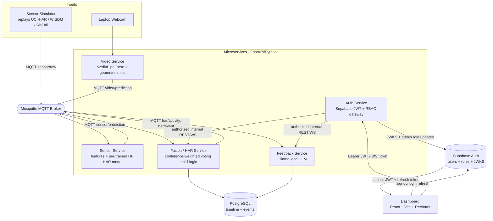
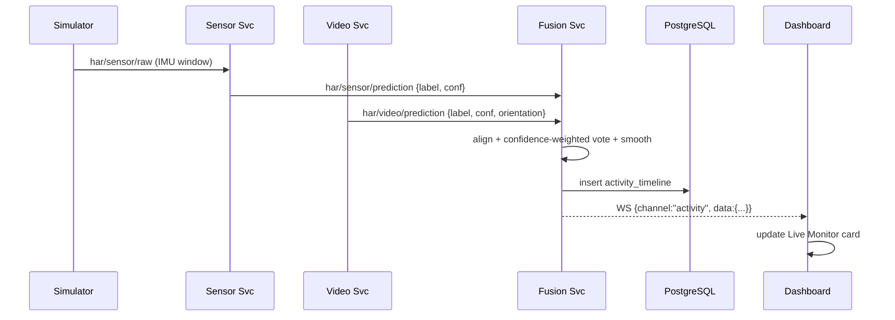
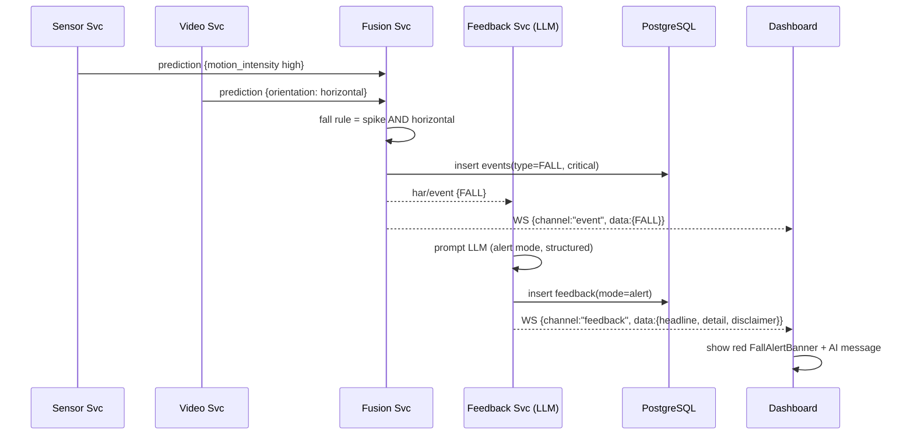

# Technical Design Document (TDD)
## Multi-Modal Human Activity Recognition System for Patient Monitoring & Personalized Health Feedback

| Field | Value |
|---|---|
| **Project** | HAR System for Patient Monitoring and Personalized Health Feedback with Multi-Modal Data |
| **Type** | College Final-Year Project |
| **Team** | Ankit Raj, Suman Kumar Jha, Tanzeem Shahzada, Aman Kumar |
| **Document** | Technical Design Document (how it is built) |
| **Version** | 1.1 (authentication and RBAC) |
| **Companion doc** | `core_docs/FUNCTIONAL_SPEC.md` (what it does) |

> This document is the engineering source of truth. It specifies the architecture, technology stack,
> per-service algorithms, data contracts, schemas, APIs, project layout, setup/run steps, testing,
> and the build roadmap. It implements every requirement in the FSD (IDs `FR-*`, `NFR-*`).

---

## 1. Architecture Overview

### 1.1 Design principles
- **Software-only Model.** The system operates completely in software on standard computer hardware, utilizing camera/webcam video feeds for pose estimation and activity recognition, and simulated sensor inputs (with no active physical IoT hardware deployment or physical wiring).
- **No model training.** All AI components use pre-trained models for inference. The project supports both local open-source models (for privacy and offline usage) and cloud-based closed-source APIs (for high accuracy and reduced local compute requirements).
- **Microservices Architecture.** Six independent services are coupled through MQTT and a protected HTTP gateway, enabling modular development, deployment, and fault isolation.
- **Privacy by construction.** The video service processes webcam or video files locally and emits only numeric body landmarks; raw video frames are immediately discarded and never persisted.
- **Robust Persistence.** PostgreSQL is used as the centralized relational database for storing activity timelines, alerts, events, and feedback.

### 1.2 Component diagram


### 1.3 Runtime data flow (summary)
1. **Simulator** publishes raw IMU windows to MQTT (`har/sensor/raw`).
2. **Sensor Service** consumes raw windows → extracts features → runs the pre-trained HF HAR model →
   publishes `{label, confidence}` to `har/sensor/prediction`.
3. **Video Service** reads webcam/video source → MediaPipe/YOLO Pose landmarks → geometric posture rules → publishes
   `{label, confidence, orientation}` to `har/video/prediction`.
4. **Fusion Service** time-aligns the two prediction streams → confidence-weighted vote + temporal
   smoothing → fall logic → publishes `har/activity` (continuous) and `har/event` (fall/abnormal),
   and writes both to **PostgreSQL**.
5. **Feedback Service** subscribes to events + periodically reads the timeline → prompts the
   **LLM (local Ollama Llama/Qwen or cloud Gemini/GPT/Claude APIs)** → produces structured feedback/alerts/summaries → stores them in **PostgreSQL** and pushes to the
   dashboard.
6. **Dashboard** logs in with Supabase, sends the access JWT to Auth Service, and keeps refresh tokens inside the Supabase client session flow.
7. **Auth Service** verifies signature/claims locally with JWKS, checks RBAC, then forwards allowed REST/WebSocket traffic to Fusion or Feedback.

---

## 2. Technology Stack

| Layer | Technology Options | Role | License / Pricing |
|---|---|---|---|
| Language (backend) | **Python 3.11+** | All services & simulator | PSF |
| Web framework | **FastAPI** + **Uvicorn** | REST + WebSocket endpoints per service | MIT / BSD |
| Authentication | **Supabase Auth** + asymmetric JWKS | Signup/login/session issuance and signed identity | Open-source / hosted free tier |
| JWT verification | **PyJWT + cryptography** | Local signature and standard-claim checks | MIT / Apache/BSD |
| Pose estimation (Open) | **MediaPipe Pose / YOLOv8 Pose / YOLOv11 Pose** | Pre-trained body-landmark detection (video) | Apache-2.0 / AGPL-3.0 |
| Pose estimation (Closed) | **Google Cloud Video Intelligence / Azure Vision API** | Cloud-based pose / activity analysis APIs | Paid Cloud Billing |
| Vision I/O | **OpenCV (opencv-python)** | Webcam capture, frame handling | Apache-2.0 |
| Sensor model (Open) | **HuggingFace Transformers / `huggingface_hub`** | Load & run a **pre-trained HAR model** (inference only) | Apache-2.0 |
| Numerics | **NumPy**, **SciPy**, **pandas** | Feature extraction, windowing, dataset replay | BSD |
| GenAI (Open-Source) | **Ollama (Llama 3.2, Qwen2.5, Phi-3-mini)** | Runs open LLMs locally, fully offline | MIT / Open model licenses |
| GenAI (Closed-Source) | **Google Gemini API, OpenAI GPT-4o-mini, Claude 3.5** | High-quality cloud LLM inference APIs | Paid API Billing |
| Messaging | **Eclipse Mosquitto** (broker) + **paho-mqtt** (client) | Inter-service pub/sub transport | EPL/EDL |
| Persistence | **PostgreSQL** | Relational database for activity timeline, events, and feedback | PostgreSQL License |
| Frontend | **React + Vite** | Dashboard SPA | MIT |
| Charts | **Recharts** | Trend/timeline charts | MIT |
| Realtime UI | **Native WebSocket** (browser) | Live updates to dashboard | — |
| Orchestration | **Docker** + **docker-compose** | Single-command containerized deployment of services | Apache-2.0 |
| Testing | **pytest** | Unit/integration tests + metrics harness | MIT |

> **Closed-Source / Cloud Model Notice:** Using cloud-based closed-source models (Gemini, GPT, Azure, etc.) requires an active internet connection and valid API keys with cloud billing enabled. Open-source options (Ollama, MediaPipe, etc.) run completely locally, offline, and free of charge.

### 2.1 Pre-trained models — selection & options
| Modality | Open-Source Options (Local & Free) | Closed-Source Options (Cloud API & Paid) | How Used |
|---|---|---|---|
| **Video** | **MediaPipe Pose** (33 landmarks) or **YOLOv8/YOLOv11 Pose** | **Google Cloud Video Intelligence** or **Azure Spatial Analysis** | Detect body joint coordinates / landmarks → run deterministic geometric rules to identify sitting, standing, walking, lying down, or falling. |
| **Sensor** | Pre-trained HAR classifiers from HuggingFace Hub (CNN, LSTM, or Transformer-based models) | **Google Cloud AutoML Tables** or custom cloud-deployed tabular endpoints | Classify features from simulated wearable sensor windows → output `{label, confidence}`. Falls back to statistical rules or LLM zero-shot prompts. |
| **Feedback** | **Llama 3.2 (1B/3B)**, **Qwen2.5 (1.5B/3B)**, or **Phi-3-mini** via Ollama | **Google Gemini 1.5 Flash**, **OpenAI GPT-4o-mini**, or **Claude 3 Haiku** | Generate natural-language feedback, alerts, and summaries based on structured timeline data from the database. |

> Using open-source models guarantees offline capabilities and zero cloud billing. If closed-source APIs are chosen during deployment, the team must configure the respective client libraries (e.g., `google-genai` or `openai`) and provide valid API keys.

---

## 3. Per-Service Design

Common conventions: every backend service is a small FastAPI app; data services subscribe/publish via paho-mqtt; each reads
config from environment variables / a shared config file (FR-X4); logs structured lines (NFR-10).

### 3.1 Sensor Service  *(implements FR-S1…FR-S6)*
- **Responsibility:** Turn raw IMU windows into activity predictions.
- **Input:** MQTT `har/sensor/raw` — windows of accelerometer/gyroscope samples (from simulator).
- **Output:** MQTT `har/sensor/prediction` — `{label, confidence, motion_intensity, ts}`.
- **Pipeline:**
  1. **Windowing:** sliding windows of **1–2 s** at **50–100 Hz** (e.g., 128 samples, 50% overlap).
  2. **Feature extraction** per axis & magnitude: **mean, std, min, max, Signal Magnitude Area (SMA),
     energy, correlation between axes, tilt/orientation angles**. (NumPy/SciPy.)
  3. **Classification:** pre-trained HF HAR model → activity label + confidence. Map model labels →
     our class set (§5.2).
  4. **Motion-intensity** signal: acceleration-magnitude peak in the window (feeds fall logic, FR-S5).
  5. Publish prediction.
- **Failure modes:** model load failure → switch to statistical/zero-shot fallback (FR-S6); empty
  window → emit `UNKNOWN`.
- **Config:** `WINDOW_SIZE`, `WINDOW_OVERLAP`, `SENSOR_MODEL_ID`, `USE_FALLBACK`.

### 3.2 Video Service  *(implements FR-V1…FR-V8)*
- **Responsibility:** Turn webcam frames into posture predictions — **without storing video**.
- **Input:** Webcam frames (OpenCV); **never published or persisted**.
- **Output:** MQTT `har/video/prediction` — `{label, confidence, orientation, ts}`.
- **Pipeline:**
  1. Capture frames at **10–15 FPS** (OpenCV).
  2. **MediaPipe Pose** → 33 landmarks `(x, y, z, visibility)` per frame.
  3. **Geometric features:** torso vertical-axis angle (vertical vs horizontal), hip/knee **joint
     angles**, shoulder-hip alignment, head-to-floor proxy, vertical motion of key joints across
     frames (for walking/exercising vs static).
  4. **Rule-based posture classification** (deterministic, no training):
     - `LYING` if torso orientation ≈ horizontal.
     - `SITTING` vs `STANDING` by hip/knee flexion + torso height ratio (both torso vertical).
     - `WALKING` if periodic horizontal displacement / leg alternation over a short window.
     - `EXERCISING` if high repetitive multi-joint motion.
     - else `UNKNOWN`.
  5. **Orientation flag** (`vertical` / `horizontal`) for fall logic (FR-V7).
  6. **Privacy:** immediately discard each frame after landmark extraction; only numbers are emitted
     (FR-V5, NFR-3).
- **Failure modes:** no person detected → `UNKNOWN` with low confidence (FR-V8); webcam unavailable →
  log + keep service alive (sensor-only fusion continues).
- **Config:** `FPS`, `HORIZONTAL_ANGLE_THRESHOLD`, `MIN_VISIBILITY`, `CAMERA_INDEX`.

### 3.3 Fusion / HAR Service  *(implements FR-F1…FR-F7)*
- **Responsibility:** Produce the single authoritative activity + events.
- **Inputs:** MQTT `har/sensor/prediction`, `har/video/prediction`.
- **Outputs:** MQTT `har/activity` (continuous), `har/event` (fall/abnormal); writes to PostgreSQL.
- **Algorithm:**
  1. **Time alignment:** buffer recent predictions per modality; align by timestamp into intervals
     (e.g., 1 s).
  2. **Confidence-weighted late fusion:** for each candidate label, score =
     `Σ (confidence_modality × weight_modality)`; pick the argmax. Default modality weights are
     configurable (e.g., sensor 0.5 / video 0.5; tunable). If one modality is missing, use the other
     (FR-F7).
  3. **Temporal smoothing:** majority/hysteresis over the last *N* fused intervals so a single noisy
     interval cannot flip the displayed label (FR-F3).
  4. **Fall detection rule (FR-F4):** raise `FALL` when **sensor motion_intensity > spike threshold**
     **AND** **video orientation == horizontal** within the same short window; suppress if only one
     condition holds (false-alarm control, NFR-2). Temporal smoothing prevents duplicate alerts.
  5. **Abnormal/inactivity (FR-F6):** track time-in-activity; raise `INACTIVITY` after a configurable
     stillness threshold; raise `ABNORMAL_PATTERN` on large deviation from recent baseline.
  6. Persist each fused activity + event to PostgreSQL; publish to dashboard.
- **Config:** `MODALITY_WEIGHTS`, `SMOOTHING_WINDOW`, `FALL_ACCEL_THRESHOLD`,
  `INACTIVITY_SECONDS`, `FUSION_INTERVAL`.

### 3.4 Feedback Service (GenAI)  *(implements FR-G1…FR-G6)*
- **Responsibility:** Generate plain-language feedback, alert text, and summaries via the GenAI model.
- **Inputs:** MQTT `har/event` (triggers immediate alert text); periodic reads of the PostgreSQL timeline
  (for feedback/summary).
- **Outputs:** Structured feedback objects stored in PostgreSQL + pushed to dashboard via WebSocket/REST.
- **LLM integration:** calls either local **Ollama** API (for open-source models like Llama 3.2 3B) or cloud APIs (for closed-source models like Google Gemini, OpenAI GPT, or Anthropic Claude). Prompts use **templates** + **structured (JSON) output** so the dashboard can render fields reliably (FR-G5).
- **Prompt design:**
  - *System role:* "You are a careful assistant that summarizes a patient's recent physical activity
    for caregivers. Be concise, use plain language, **never diagnose**, **always include a brief
    safety disclaimer**, and recommend contacting a professional for medical concerns." (FR-G4, NFR-11)
  - *User content:* a compact, structured digest of the recent timeline / the triggering event.
  - *Required output fields:* `headline`, `detail`, `severity` (`info|warning|critical`),
    `recommendations[]`, `disclaimer`.
- **Modes:**
  - **Alert mode** (on `FALL`/abnormal event): short, urgent, structured alert (FR-G2).
  - **Feedback mode** (on demand/periodic): advice from recent pattern (FR-G1).
  - **Summary mode** (scheduled): daily/periodic recap (FR-G3).
- **Failure modes:** LLM unreachable → template-based fallback text so the dashboard still shows
  something; offline operation supported once the model is pulled (FR-G6, NFR-8).
- **Config:** `LLM_MODEL`, `OLLAMA_HOST` (if using Ollama), `GEMINI_API_KEY`/`OPENAI_API_KEY` (if using cloud APIs), `FEEDBACK_INTERVAL`, `SUMMARY_SCHEDULE`.

### 3.5 Dashboard Service  *(implements FR-D1…FR-D7)*
- **Stack:** React + Vite SPA; Recharts for charts; native WebSocket client for live updates; REST for
  history.
- **Component tree (indicative):**
  ```
  App
  ├── StatusBar (system/modality health — FR-D6)
  ├── FallAlertBanner (live critical alert — FR-D2)
  ├── LiveMonitor (current activity card — FR-D1)
  ├── ActivityTimeline (history list/bar — FR-D3)
  ├── TrendsPanel (Recharts: per-activity time, over-time — FR-D4)
  ├── AIFeedbackPanel (GenAI feedback + summary — FR-D5)
  └── AlertsLog (event list + acknowledge — FR-D7)
  ```
- **Data sources:** WebSocket channel for `activity`, `event`, `feedback`; REST for timeline/trends/
  history on load.
- **Backend-for-frontend:** Fusion and Feedback endpoints are consumed only through the required
  Auth Service gateway (§4.3).

### 3.6 Auth Service *(implements FR-A1…FR-A8)*

- **Responsibility:** public REST/WebSocket entry point, Supabase JWT verification, role enforcement,
  safe role administration, and allowed-request forwarding.
- **Input:** `Authorization: Bearer <access JWT>`; never accepts passwords or refresh tokens.
- **Verification:** allow-listed asymmetric algorithm, JWKS signature, issuer, audience, expiry,
  user/session IDs and `user_role` custom claim.
- **Authorization:** explicit default-deny matrix. Missing/invalid identity is 401; valid identity
  without permission is 403.
- **WebSocket:** authenticated REST issues an HMAC-signed, one-time, target-bound ticket.
- **Network:** Fusion/Feedback remain Compose-internal; only Auth Service port 8005 is published.
- **Admin:** role upsert uses the backend-only Supabase service-role key and returns sanitized errors.
- **Detailed design:** `core_docs/milestones/milestone-6-auth-rbac/TDD.md`.

---

## 4. Data Contracts

### 4.1 MQTT topics
| Topic | Publisher | Subscriber(s) | Payload |
|---|---|---|---|
| `har/sensor/raw` | Simulator (or ESP32) | Sensor Service | Raw IMU window |
| `har/sensor/prediction` | Sensor Service | Fusion Service | Sensor prediction |
| `har/video/prediction` | Video Service | Fusion Service | Video prediction |
| `har/activity` | Fusion Service | Feedback, Dashboard | Fused current activity |
| `har/event` | Fusion Service | Feedback, Dashboard | Fall / abnormal / inactivity event |
| `har/feedback` | Feedback Service | Dashboard | GenAI feedback object |

### 4.2 JSON message formats
**`har/sensor/raw`**
```json
{
  "ts": "2026-06-20T10:00:00.000Z",
  "device_id": "sim-01",
  "sampling_hz": 50,
  "window": {
    "accel": [[ax, ay, az], "...128 samples..."],
    "gyro":  [[gx, gy, gz], "...128 samples..."]
  }
}
```
**`har/sensor/prediction`**
```json
{ "ts": "...", "modality": "sensor", "label": "WALKING", "confidence": 0.88, "motion_intensity": 0.31 }
```
**`har/video/prediction`**
```json
{ "ts": "...", "modality": "video", "label": "LYING", "confidence": 0.82, "orientation": "horizontal" }
```
**`har/activity`** (fused)
```json
{ "ts": "...", "activity": "WALKING", "confidence": 0.90,
  "contributors": { "sensor": "WALKING", "video": "WALKING" } }
```
**`har/event`**
```json
{ "ts": "...", "type": "FALL", "severity": "critical", "confidence": 0.93,
  "evidence": { "motion_intensity": 0.95, "orientation": "horizontal" } }
```
**`har/feedback`**
```json
{ "ts": "...", "mode": "alert",
  "headline": "Possible fall detected",
  "detail": "A sudden movement followed by a lying position was detected at 10:00.",
  "severity": "critical",
  "recommendations": ["Check on the patient immediately."],
  "disclaimer": "This is an automated assistive tool and not a medical diagnosis." }
```

> Activity labels everywhere are exactly the FSD set: `WALKING, SITTING, STANDING, LYING,
> EXERCISING, UNKNOWN`. Event types: `FALL, INACTIVITY, ABNORMAL_PATTERN`. (Matches FSD §5.)

### 4.3 REST + WebSocket API (consumed by dashboard)
| Method | Path | Service | Purpose |
|---|---|---|---|
| `GET` | `/api/auth/me` | Auth gateway | Verified user ID, email and role |
| `POST` | `/api/auth/ws-ticket` | Auth gateway | One-time Fusion/Feedback WebSocket ticket |
| `PUT` | `/api/admin/users/{id}/role` | Auth gateway | Admin-only role assignment |
| `GET` | `/api/status` | Auth → Fusion | Current activity + modality/service health (FR-D1, FR-D6) |
| `GET` | `/api/timeline?from=&to=` | Fusion/gateway | Activity history for the range (FR-D3) |
| `GET` | `/api/trends?period=` | Fusion/gateway | Aggregated per-activity time / over-time (FR-D4) |
| `GET` | `/api/events?from=&to=` | Fusion/gateway | Event/alert log (FR-D2, FR-D7) |
| `POST` | `/api/events/{id}/ack` | Fusion/gateway | Acknowledge an alert (FR-D7) |
| `GET` | `/api/feedback/latest` | Auth → Feedback | Latest GenAI feedback (FR-D5) |
| `POST` | `/api/feedback/generate` | Auth → Feedback | On-demand feedback/summary (FR-G1, FR-G3) |
| `WS` | `/ws`, `/feedback-ws` | Auth → internal service | Ticket-protected live streams |

**WebSocket event envelope**
```json
{ "channel": "event", "data": { "...one of the JSON payloads above..." } }
```

### 4.4 PostgreSQL schema (DDL)
```sql
CREATE TABLE activity_timeline (
  id           SERIAL PRIMARY KEY,
  ts           TIMESTAMPTZ NOT NULL,      -- timezone-aware timestamp
  activity     VARCHAR(20) NOT NULL,      -- WALKING|SITTING|STANDING|LYING|EXERCISING|UNKNOWN
  confidence   DOUBLE PRECISION NOT NULL,
  sensor_label VARCHAR(20),
  video_label  VARCHAR(20)
);

CREATE TABLE events (
  id           SERIAL PRIMARY KEY,
  ts           TIMESTAMPTZ NOT NULL,
  type         VARCHAR(20) NOT NULL,      -- FALL|INACTIVITY|ABNORMAL_PATTERN
  severity     VARCHAR(10) NOT NULL,      -- info|warning|critical
  confidence   DOUBLE PRECISION NOT NULL,
  evidence     JSONB,                     -- JSONB blob for unstructured metadata
  acknowledged BOOLEAN NOT NULL DEFAULT FALSE
);

CREATE TABLE feedback (
  id           SERIAL PRIMARY KEY,
  ts           TIMESTAMPTZ NOT NULL,
  mode         VARCHAR(20) NOT NULL,      -- alert|feedback|summary
  headline     VARCHAR(100),
  detail       TEXT,
  severity     VARCHAR(10),
  payload      JSONB                      -- full JSON structure (recommendations[], disclaimer, etc.)
);

CREATE INDEX idx_timeline_ts ON activity_timeline(ts);
CREATE INDEX idx_events_ts   ON events(ts);
```

---

## 5. Datasets & Class Mapping

### 5.1 Candidate public datasets (free, for the simulator & metrics)
| Dataset | Content | Use here |
|---|---|---|
| **UCI HAR** | Smartphone accel/gyro, 6 daily activities, labeled. | Default activity replay & metrics. |
| **WISDM** | Accelerometer activities (walking, sitting, etc.). | Alternative activity replay. |
| **SisFall** | Falls + ADLs from elderly-relevant protocol. | **Fall** scenarios for fall-detection metrics. |

The simulator replays a chosen dataset's samples in real time over `har/sensor/raw`, preserving
ground-truth labels for the metrics harness (§9). Datasets live under `data/` (gitignored).

### 5.2 Label mapping (model/dataset → our classes)
A single mapping table (in `shared/`) maps each source label to our canonical set
(`WALKING, SITTING, STANDING, LYING, EXERCISING, UNKNOWN`). Example: UCI's
`WALKING/WALKING_UPSTAIRS/WALKING_DOWNSTAIRS → WALKING`, `SITTING → SITTING`,
`STANDING → STANDING`, `LAYING → LYING`. Anything unmapped → `UNKNOWN`. Fall scenarios from SisFall
drive the `FALL` event path (motion spike + horizontal).

---

## 6. Repository / Folder Structure

```
HAR-System/
├── core_docs/
│   ├── FUNCTIONAL_SPEC.md
│   └── TECHNICAL_DESIGN.md
├── services/
│   ├── sensor_service/
│   │   ├── app.py            # FastAPI app + MQTT loop
│   │   ├── features.py       # windowing + feature extraction
│   │   ├── classifier.py     # HF model load/inference + fallback
│   │   └── config.py
│   ├── video_service/
│   │   ├── app.py            # webcam loop + MQTT publish
│   │   ├── pose.py           # MediaPipe wrapper (landmarks)
│   │   ├── rules.py          # geometric posture/fall rules
│   │   └── config.py
│   ├── fusion_service/
│   │   ├── app.py            # MQTT subscribe + REST/WS + persistence
│   │   ├── fusion.py         # confidence-weighted voting + smoothing
│   │   ├── falldetect.py     # fall + abnormal/inactivity logic
│   │   └── config.py
│   ├── feedback_service/
│   │   ├── app.py            # REST/WS + MQTT subscribe
│   │   ├── llm.py            # Ollama client + prompt templates
│   │   └── config.py
│   └── auth_service/         # Supabase JWT verification + RBAC + protected proxy
├── simulator/
│   ├── replay.py            # streams a dataset over MQTT (har/sensor/raw)
│   └── datasets/            # loaders + label mapping
├── shared/
│   ├── schemas.py           # pydantic models for all JSON payloads
│   ├── topics.py            # MQTT topic constants
│   ├── labels.py            # canonical activity/event labels + mapping
│   └── db.py                # PostgreSQL helpers + DDL
├── dashboard/               # React + Vite app
│   ├── src/components/...    # StatusBar, FallAlertBanner, LiveMonitor, ...
│   └── src/api/             # REST + WebSocket clients
├── data/                    # downloaded datasets (gitignored)
├── tests/                   # pytest unit/integration + metrics harness
├── docker-compose.yml       # Mosquitto + all services + dashboard
├── .env.example             # config defaults
└── README.md
```

Each service maps 1:1 to a folder; `shared/` holds the contracts (schemas, topics, labels, DB) so all
services agree (single source of truth for FR-X4 config & data contracts).

---

## 7. Configuration

All tunables are environment variables (documented in `.env.example`), satisfying FR-X4 / NFR-9:

| Variable | Default | Used by | Description / Options |
|---|---|---|---|
| `MQTT_HOST` / `MQTT_PORT` | `localhost` / `1883` | all | MQTT broker address and port. |
| `DATABASE_URL` | `postgresql://user:pass@db:5432/hardb` | fusion, feedback | Connection string for PostgreSQL database. |
| `WINDOW_SIZE` / `WINDOW_OVERLAP` | `128` / `0.5` | sensor | Sliding window parameters for sensor features. |
| `SENSOR_MODEL_ID` | *(pinned HF model id)* | sensor | Pre-trained model ID from HuggingFace Hub. |
| `USE_FALLBACK` | `false` | sensor | Enable statistical heuristic rules as fallback. |
| `FPS` | `12` | video | Webcam capture frame rate. |
| `HORIZONTAL_ANGLE_THRESHOLD` | `~60°` | video, fusion | Pitch angle threshold to identify horizontal body posture. |
| `MODALITY_WEIGHTS` | `sensor=0.5,video=0.5` | fusion | Late fusion voting weights per modality. |
| `SMOOTHING_WINDOW` | `5` | fusion | Window size for temporal label smoothing. |
| `FALL_ACCEL_THRESHOLD` | *(tuned on SisFall)* | fusion | Acceleration magnitude spike threshold for fall detection. |
| `INACTIVITY_SECONDS` | `1800` | fusion | Threshold duration for prolonged inactivity detection. |
| `LLM_PROVIDER` | `ollama` | feedback | GenAI provider: `ollama` (open-source) or `gemini` / `openai` / `anthropic` (closed-source APIs). |
| `LLM_MODEL` | `llama3.2:3b` | feedback | Model identifier (e.g., `llama3.2:3b` for Ollama, `gemini-1.5-flash` for Gemini API). |
| `OLLAMA_HOST` | `http://localhost:11434` | feedback | Local Ollama endpoint url (only if provider is `ollama`). |
| `GEMINI_API_KEY` | *(optional)* | feedback | Google Gemini API key (required if provider is `gemini`). |
| `OPENAI_API_KEY` | *(optional)* | feedback | OpenAI API key (required if provider is `openai`). |
| `DATASET` | `uci-har` | simulator | Dataset directory to stream simulated IMU windows. |
| `SUPABASE_URL` / `SUPABASE_PUBLISHABLE_KEY` | *(required)* | auth, dashboard | Project URL and browser-safe client key. |
| `SUPABASE_SERVICE_ROLE_KEY` | *(server secret)* | auth | Admin role updates only; never exposed to React. |
| `AUTH_TICKET_SECRET` | *(32+ random chars)* | auth | Signs short-lived WebSocket tickets. |

---

## 8. Sequence Diagrams

### 8.1 Normal activity update


### 8.2 Fall alert flow


---

## 9. Testing Strategy

| Level | What | Tooling |
|---|---|---|
| **Unit** | Feature math (mean/std/SMA/tilt), geometric rule thresholds, fusion voting & smoothing, fall rule, label mapping. | pytest |
| **Integration** | MQTT round-trip (publish raw → sensor prediction → fusion activity), DB writes, WS push. | pytest + local Mosquitto |
| **Contract** | All payloads validate against `shared/schemas.py` (pydantic). | pytest |
| **GenAI** | Feedback returns required structured fields + disclaimer; alert mode produces critical severity. | pytest (mock + live LLM) |
| **Metrics harness** (FR-X5, NFR-2) | Replay a **labeled** dataset, collect fused predictions, compute **per-class F1**, **fall precision/recall**, and **end-to-end latency**; compare **fusion vs sensor-only vs video-only**. | `tests/metrics/` |

**Metrics harness output (for the report):** a table of `{method: F1}` for Sensor-only / Video-only /
Fusion, plus fall `precision`/`recall` and average latency — directly populating the results slide.

---

## 10. Deployment & Local Setup (one-command demo)

### 10.1 Prerequisites
- Docker + docker-compose, Python 3.11+, Node 18+ (for dashboard dev), a working webcam.
- **PostgreSQL** running containerized or locally.
- *(Optional)* **Ollama** installed locally (only required if running local open-source LLMs); pull the model: `ollama pull llama3.2:3b`.
- Download a dataset (e.g., UCI HAR / SisFall) into `data/` (one-time, online).

### 10.2 Run
```bash
# 1) one-time: pull the local LLM (if using Ollama) and datasets
ollama pull llama3.2:3b
python simulator/datasets/download.py --dataset uci-har   # fetches into data/

# 2) after Supabase setup and .env configuration, start everything
docker-compose up --build

# 3) start the sensor replay (no hardware needed, software simulator only)
python simulator/replay.py --dataset uci-har --realtime

# 4) open the dashboard
#    http://localhost:5173   (Vite dev)  or the compose-exposed port
```
`docker-compose` brings up: `db` (PostgreSQL), `mosquitto`, `sensor_service`, `video_service`, `fusion_service`,
`feedback_service`, `auth_service`, `dashboard`. The video service uses the host webcam (device passthrough).

### 10.3 Ports (indicative)
| Service | Port | Description |
|---|---|---|
| PostgreSQL (DB) | 5432 | Primary database storage |
| Mosquitto (MQTT) | 1883 | Message broker |
| Fusion internal API/WS | 8001 | Fused activity & alerts; not host-published in secured Compose |
| Feedback internal API/WS | 8002 | GenAI text; not host-published in secured Compose |
| Auth API/WS | 8005 | Public JWT/RBAC gateway; Fusion/Feedback are internal in Compose |
| Ollama | 11434 | Local LLM host (optional) |
| Dashboard | 5173 | User interface dashboard |

---

## 11. Implementation Roadmap (re-scoped, no-hardware / no-training)

Mapped from the original 10-phase roadmap, re-scoped to software-only and split for the 4-person team
to parallelize:

| Phase | Original | Re-scoped deliverable | Owner (suggested) |
|---|---|---|---|
| 1 | Requirements | These two `core_docs` + repo skeleton + `shared/` contracts. | All |
| 2 | Literature review | Short survey notes (HAR, pose, fusion) for the report. | All |
| 3 | Hardware/sensor pipeline | **Simulator** replaying UCI-HAR/SisFall over MQTT + Mosquitto up. | Dev A |
| 4 | Video & pose | **Video Service**: MediaPipe + geometric rules (no training). | Dev B |
| 5 | Sensor model | **Sensor Service**: features + pre-trained HF model + fallback. | Dev A |
| 6 | Multi-modal fusion | **Fusion Service**: confidence-weighted voting + smoothing + fall rule. | Dev C |
| 7 | Cloud/real-time | Replace cloud with **MQTT + PostgreSQL**; wire end-to-end real-time. | Dev C |
| 8 | Dashboard | **React + Vite** dashboard (live + history + trends). | Dev D |
| 9 | Feedback engine | **Feedback Service** with **LLM Integration (Ollama / Cloud APIs)**. | Dev B/D |
| 10 | Testing & report | **Metrics harness**, demo checklist (FSD §11), PPT/report. | All |
| 11 | Authentication & RBAC | **Supabase Auth + FastAPI gateway + role matrix + protected WebSockets**. | All |

---

## 12. Optional Future Hardware Path (documented, not built)

The project focuses strictly on a **software-only model** deployment. For teams that later choose to incorporate hardware, the **same software pipeline** can be extended: a physical microcontroller like an **ESP32 + MPU6050 IMU sensor** can read physical motions, format them to match the `har/sensor/raw` JSON schema, and publish to Mosquitto over Wi-Fi (MQTT) — replacing the software simulator with zero changes downstream. (Other future expansions include: heart rate sensors, custom physical cameras, multi-person tracking, and edge-AI accelerators.)

---

## 13. Risks & Mitigations (engineering)

| Risk | Mitigation |
|---|---|
| HF HAR model labels don't map to our 6 classes. | Label-mapping table (§5.2) + statistical/zero-shot fallback (FR-S6). |
| Local LLM latency on CPU. | Small 3B model (if local Ollama is chosen); run feedback generation on-demand or periodically, not per-frame; template-based text fallback. |
| Webcam rule misclassification. | Fusion + temporal smoothing; tune thresholds via config. |
| Time-sync drift between modalities. | Timestamp every message; align in fusion buffer with tolerance window. |
| False fall alarms. | Require both modalities for high-confidence fall; hysteresis smoothing. |
| Docker webcam passthrough issues. | Document a non-Docker run mode for the video service as fallback. |
| Supabase unavailable during login/refresh. | Verify JWTs locally; show a clear auth error; never bypass authentication. |
| Service-role key leaked. | Backend-only env, no `VITE_` prefix, secret scan, rotation and role-audit review. |

---

## 14. Compliance Checklist

- [ ] Every dependency in §2 matches open-source licensing or has cloud credentials configured if using closed-source APIs.
- [ ] Centralized database is fully migrated to PostgreSQL, containerized in docker-compose.
- [ ] If using cloud-based closed-source models (Gemini, GPT, Azure), verify active internet connection and valid API keys.
- [ ] No custom model training is performed — only pre-trained inference models (e.g., MediaPipe/YOLO Pose, HF models, local Ollama or cloud GenAI).
- [ ] Raw video is never stored or transmitted (NFR-3, FR-V5).
- [ ] Supabase service-role key is absent from frontend source/build output and logs.
- [ ] Protected REST/WebSocket routes pass JWT, 401/403 and RBAC tests.

---

*End of Technical Design Document. User-facing behaviour and acceptance criteria are specified in
`core_docs/FUNCTIONAL_SPEC.md`.*
