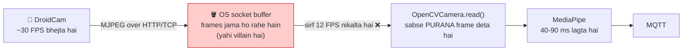
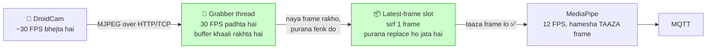

# Feature TDD: Real-Time Video Streaming — Latest-Frame Capture Design

> **TDD = Technical Design Document.** FSD ne bataya **kya** banana hai. Yeh doc batata hai **kaise** banega — code, class, config, aur test.
> Pehle padho: [FSD.md](./FSD.md)

---

## 1. Abhi ka architecture (jisme problem hai)



**Villain saaf dikh raha hai:** andar 30 FPS ja raha hai, bahar 12 FPS aa raha hai. Beech ka buffer bharta ja raha hai, aur `read()` us buffer se **sabse purana** frame nikaal raha hai.

## 2. Naya architecture (fix ke baad)



**Key insight:** ab **koi backlog ban hi nahi sakta**, kyunki grabber thread jitna aata hai utna padh leta hai. Buffer hamesha khaali. Slot me hamesha ek hi frame — sabse naya.

---

## 3. Root cause deep-dive (code ke saath)

### Cause 1 — Producer/consumer speed mismatch

[pipeline.py:166-182](../../../../services/video_service/pipeline.py#L166-L182) me capture loop:

```python
async def _capture_until_failure(self) -> None:
    interval = 1.0 / self.settings.fps          # 1/12 = 0.083 sec
    deadline = self.monotonic()
    while not self._stop.is_set():
        camera = self._camera
        if camera is None:
            raise ConnectionError("camera closed")
        ok, frame = await self.run_blocking(camera.read)   # ⚠️ purana frame aata hai
        ...
        deadline += interval
        await asyncio.sleep(max(0.0, deadline - self.monotonic()))   # ⚠️ jaanbujhkar ruk rahe hain
```

Aakhri line har frame ke baad **ruk** jaati hai taaki 12 FPS bana rahe. USB webcam ke liye yeh **sahi** hai (driver naya frame deta hai). Network stream ke liye yeh **ghaatak** hai — jitni der hum rukte hain, utne frames buffer me jama hote hain.

> **Yeh code bura nahi hai.** Yeh USB webcam ke liye likha gaya tha, aur wahan sahi kaam karta hai. Bug tab aaya jab `CAMERA_INDEX` me URL daala gaya — ek naya use-case jiske liye yeh design nahi hua tha.

### Cause 2 — `CAP_PROP_FPS` network stream par kaam nahi karta

[adapters.py:29-30](../../../../services/video_service/adapters.py#L29-L30):

```python
self._capture = cv2.VideoCapture(target_index)
self._capture.set(cv2.CAP_PROP_FPS, fps)     # ⚠️ URL ke case me chupchaap ignore
```

`set()` bina error ke `False` return karta hai aur hum uska return check hi nahi karte. Phone ko Wi-Fi se "dheere bhej" nahi bola ja sakta.

### Cause 3 — `CAP_PROP_BUFFERSIZE` set hi nahi hai (aur woh bhi bachaayega nahi)

Bahut saare blog kehte hain `cap.set(cv2.CAP_PROP_BUFFERSIZE, 1)` laga do, sab theek.

**Sach:** yeh property sirf kuch backends par kaam karti hai — V4L2 (Linux USB webcam) aur DSHOW (Windows). Hamara URL **FFmpeg backend** se khulta hai, aur **FFmpeg ise support nahi karta**.

Isiliye hum thread wala solution use kar rahe hain — kyunki woh backend par depend hi nahi karta. Buffer size set karna hum phir bhi karenge (USB webcam ko fayda hoga), par **woh asli fix nahi hai.**

### Cause 4 — decode aur pose ka time

| Step | Time |
|---|---|
| Phone: capture + JPEG encode | ~30-60 ms |
| Wi-Fi transfer | ~5-20 ms |
| OpenCV: JPEG decode | ~5-10 ms |
| MediaPipe pose | ~40-90 ms |
| Classify + MQTT publish | ~1-5 ms |
| **Total (buffer backlog ke bina)** | **~80-185 ms** ✅ |

Dekho — **backlog hata do to hum already 300 ms ke andar hain.** Isliye MediaPipe optimize karne ki zaroorat nahi. Poora problem sirf backlog hai.

---

## 4. Design: `LatestFrameCamera`

### 4.1 Yeh design kyun chuna

Sabse achhi baat: `VideoPipeline` ek **Protocol** ke against likha gaya hai, class ke against nahi — [pipeline.py:23-29](../../../../services/video_service/pipeline.py#L23-L29):

```python
class Camera(Protocol):
    @property
    def is_opened(self) -> bool: ...
    def read(self) -> tuple[bool, Any]: ...
    def release(self) -> None: ...
```

Matlab pipeline ko farak hi nahi padta ki camera kaun hai — bas yeh 3 cheezein honi chahiye.

> **Isliye hum ek naya camera bana sakte hain jo purane camera ko lapet le (wrap kare), aur `pipeline.py` ko chhune ki zaroorat hi nahi padegi.** Yeh **Decorator pattern** hai. Kam risk, kam code, purane tests safe.

### 4.2 `read()` ka naya matlab

Yeh design ka sabse chalaak hissa hai:

- **Purana `read()`**: "buffer se agla frame do" (chahe purana ho).
- **Naya `read()`**: "**naya** frame do. Agar abhi naya nahi aaya, thoda ruk kar do. Bahut der ho gayi to `(False, None)` do."

`(False, None)` dene se kya hoga? [pipeline.py:174-175](../../../../services/video_service/pipeline.py#L174-L175) already usko handle karta hai — woh `ConnectionError` uthata hai, jo reconnect logic trigger karta hai. **Free me FR-V5 (reconnect) mil gaya, bina naya code likhe.** ✨

Aur `deadline` wali pacing? Woh ab **automatically sahi ho jaayegi** — grabber thread purane frames fenk raha hai, toh jab bhi pipeline `read()` maangega, use taaza frame hi milega. Pacing rakhna theek hai (MediaPipe ko overload se bachaata hai).

### 4.3 Code sketch

`services/video_service/adapters.py` me add karo:

```python
import threading


class LatestFrameCamera:
    """Ek background thread frames ko drain karta hai; sirf newest frame rakha jaata hai.

    Network streams (MJPEG over HTTP) par frames socket buffer me jama ho jaate hain
    agar unhe padha na jaaye, aur read() phir purana frame deta hai. Yeh wrapper us
    backlog ko banne hi nahi deta.

    Privacy: kisi bhi waqt zyada se zyada EK frame memory me hota hai; naya aate hi
    purana reference chhoot jaata hai. Koi disk write, koi encode nahi.
    """

    def __init__(self, inner: Camera, *, read_timeout: float = 5.0) -> None:
        self._inner = inner
        self._read_timeout = read_timeout
        self._lock = threading.Lock()
        self._new_frame = threading.Condition(self._lock)
        self._frame: Any = None
        self._seq = 0            # har naye frame par badhta hai
        self._last_returned = 0  # aakhri seq jo pipeline ko diya
        self._dropped = 0        # jitne frames bina process kiye fenke gaye
        self._failed = False
        self._stop = threading.Event()
        self._thread = threading.Thread(
            target=self._drain, name="video-frame-grabber", daemon=True
        )
        self._thread.start()

    @property
    def is_opened(self) -> bool:
        return self._inner.is_opened and not self._failed

    def _drain(self) -> None:
        """Stream ki poori speed par padho aur sirf newest frame rakho."""
        while not self._stop.is_set():
            ok, frame = self._inner.read()   # blocking; agla JPEG aane tak rukta hai
            with self._new_frame:
                if not ok or frame is None:
                    self._failed = True
                    self._new_frame.notify_all()
                    return
                if self._seq > self._last_returned:
                    self._dropped += 1       # pichhla frame bina process kiye ja raha hai
                self._frame = frame          # purana reference yahin chhoot gaya
                self._seq += 1
                self._new_frame.notify_all()

    def read(self) -> tuple[bool, Any]:
        """Sabse naya frame do. Purana frame dobara kabhi nahi milega."""
        with self._new_frame:
            got_new = self._new_frame.wait_for(
                lambda: self._seq > self._last_returned or self._failed,
                timeout=self._read_timeout,
            )
            if self._failed or not got_new:
                return False, None           # pipeline reconnect karega
            self._last_returned = self._seq
            frame, self._frame = self._frame, None
            return True, frame

    def stats(self) -> dict[str, int]:
        with self._lock:
            return {"frames_dropped": self._dropped, "frames_captured": self._seq}

    def release(self) -> None:
        self._stop.set()
        self._thread.join(timeout=2.0)       # hang se bachne ke liye timeout zaroori
        self._inner.release()
```

### 4.4 Line-by-line samajh

| Cheez | Kyun hai |
|---|---|
| `daemon=True` | Agar thread kisi wajah se atak jaye, Python process phir bhi exit kar payega |
| `threading.Condition` | `while True: sleep(0.001)` (busy-wait) CPU khaata hai. Condition **sota hai** aur naya frame aate hi jaag jaata hai — 0% CPU waste |
| `wait_for(..., timeout=5)` | Stream mar gaya to hamesha ke liye latka nahi rahega — `(False, None)` dega |
| `self._seq > self._last_returned` | Yahi **guarantee** hai ki purana frame dobara nahi milega |
| `frame, self._frame = self._frame, None` | Slot khaali kar diya — memory turant free, privacy safe |
| `join(timeout=2.0)` | Bina timeout ke `release()` hamesha ke liye hang kar sakta hai |
| `self._dropped` | FR-V4 ke liye proof — "system sach me frames drop kar raha hai" |

> **Yeh bahut important hai:** `_drain()` me `self._inner.read()` **lock ke bahar** hai. Agar woh lock ke andar hota, to network wait ke dauraan `read()` bhi block ho jaata aur poora fayda khatam. Lock sirf frame swap karne ke liye — microseconds ke liye.

---

## 5. Wiring (kahan-kahan badlega)

### 5.1 `adapters.py` — buffer hint + option

`OpenCVCamera.__init__` me `CAP_PROP_FPS` ke baad:

```python
        # USB webcams (V4L2/DSHOW) ise maante hain; FFmpeg network streams ignore
        # karte hain — unke liye LatestFrameCamera hi asli fix hai.
        self._capture.set(cv2.CAP_PROP_BUFFERSIZE, 1)
        self._is_network = not camera_index.isdigit()
```

### 5.2 `config.py` — do nayi settings

```python
    low_latency_capture: bool = Field(default=True)
    capture_read_timeout: float = Field(default=5.0, ge=0.5, le=30.0)
```

### 5.3 `app.py` — factory me wrap karo

Abhi [app.py:50](../../../../services/video_service/app.py#L50):

```python
camera_factory=lambda: OpenCVCamera(video_settings.camera_index, video_settings.fps),
```

Naya:

```python
def _build_camera() -> Camera:
    camera = OpenCVCamera(video_settings.camera_index, video_settings.fps)
    is_network = not video_settings.camera_index.isdigit()
    if video_settings.low_latency_capture and is_network:
        return LatestFrameCamera(camera, read_timeout=video_settings.capture_read_timeout)
    return camera
```

**USB webcam ko wrap nahi kar rahe** — wahan driver already latest frame deta hai, aur extra thread bekaar hai. Isse FR-V6 (purana behaviour safe) apne aap pura ho jaata hai.

### 5.4 `.env` — FFmpeg ko low-latency mode me daalo

Yeh **bonus** hai — OpenCV ke FFmpeg backend ko batata hai ki apna internal buffer mat banao:

```bash
# Video service — real-time capture
VIDEO_LOW_LATENCY=true
CAPTURE_READ_TIMEOUT=5.0

# FFmpeg ko andar-hi-andar buffer banane se roko (MJPEG/RTSP ke liye)
OPENCV_FFMPEG_CAPTURE_OPTIONS=fflags;nobuffer|flags;low_delay
```

Format thoda ajeeb hai — `key;value` aur `|` se alag. Yeh OpenCV ka apna format hai.

> ⚠️ Yeh env var OpenCV **import hone se pehle** set hona chahiye. Compose me `environment:` block me daalo — process start hone par hi mil jaayega. **Yeh sirf madad karta hai; asli fix `LatestFrameCamera` hai.**

Aur `docker-compose.yml` ke `video-service` ke `environment:` block me:

```yaml
      VIDEO_LOW_LATENCY: ${VIDEO_LOW_LATENCY:-true}
      CAPTURE_READ_TIMEOUT: ${CAPTURE_READ_TIMEOUT:-5.0}
      OPENCV_FFMPEG_CAPTURE_OPTIONS: ${OPENCV_FFMPEG_CAPTURE_OPTIONS:-}
```

> 🚨 **Yeh step bhoolna mat.** Docker Compose **sirf wahi env var** container ke andar bhejta hai jo service ke `environment:` block me **likha ho**. `.env` me likhne se apne aap nahi jaata. Yeh galti is project me **pehle ho chuki hai** — `SUPER_ADMIN_EMAILS` isi wajah se container tak nahi pahunch raha tha.

---

## 6. Privacy par asar

Project ka core vaada: **raw frame kabhi bahar nahi jaata.** Yeh design usko todta nahi:

| Rule | Status |
|---|---|
| Memory me kitne frames? | **1** (`self._frame`), naya aate hi purana replace |
| Disk par likhte hain? | **Nahi** — koi `imwrite`/`imencode`/`base64` nahi |
| Network par frame? | **Nahi** — MQTT par sirf label + confidence jaata hai |
| Contract test | [test_video_privacy.py](../../../../tests/contract/test_video_privacy.py) bina badle pass hona chahiye |

`read()` me `self._frame = None` karna sirf memory ke liye nahi — yeh **privacy boundary ko explicit** banata hai. Frame slot me se nikal gaya, ab woh sirf pipeline ke paas hai, jo use process karke [pipeline.py:180](../../../../services/video_service/pipeline.py#L180) par `del frame` kar deta hai.

---

## 7. Latency ko naapo (FR-V4)

Bina naapey "fix ho gaya" bolna galat hai. `VideoPipeline` me:

```python
    # _capture_until_failure ke andar, process_frame se pehle
    frame_start = self.monotonic()
    ...
    # process_frame ke baad
    frame_age_ms = (self.monotonic() - frame_start) * 1000.0
```

Aur health detail me stats:

```python
        stats = camera.stats() if hasattr(camera, "stats") else {}
        self._health = DependencyHealth(
            status="healthy",
            detail=f"{self.settings.fps:g} FPS, dropped={stats.get('frames_dropped', 0)}",
        )
```

**Kya dekhna hai:**
- `frames_dropped` **badh raha hai** = ✅ system sach me purane frames fenk raha hai (yahi to chahiye tha!)
- `frames_dropped` **0 hai** aur latency zyada hai = ⚠️ wrapper laga hi nahi (`VIDEO_LOW_LATENCY` check karo)

---

## 8. Test plan

### 8.1 Unit tests — `tests/unit/test_latest_frame_camera.py`

Asli camera ki zaroorat nahi. Ek **fake camera** bana lo:

| Test | Kya check karta hai |
|---|---|
| `test_read_returns_newest_frame_not_oldest` | Fake camera 1,2,3,4,5 de. Ek `read()` par **5** mile, 1 nahi. **Yeh core test hai.** |
| `test_old_frames_are_counted_as_dropped` | Upar wale case me `frames_dropped == 4` ho |
| `test_read_never_returns_same_frame_twice` | Do baar `read()`, doosra naye frame ka intezaar kare |
| `test_read_returns_false_when_stream_dies` | Fake camera `(False, None)` de → `read()` `(False, None)` de |
| `test_read_times_out_on_stalled_stream` | Camera hang → chhote timeout ke saath `(False, None)`, hamesha ke liye na latke |
| `test_release_stops_thread` | `release()` ke baad `thread.is_alive()` `False` ho |
| `test_frame_slot_is_cleared_after_read` | `read()` ke baad internal slot `None` ho (privacy) |

### 8.2 Integration test

| Test | Kya check karta hai |
|---|---|
| `test_pipeline_reconnects_when_camera_read_fails` | `(False, None)` → reconnect chale (yeh already hona chahiye) |
| `test_usb_webcam_path_is_not_wrapped` | `CAMERA_INDEX=0` → `LatestFrameCamera` **na** bane |
| `test_network_url_is_wrapped` | `CAMERA_INDEX=http://...` → `LatestFrameCamera` bane |

### 8.3 Manual test (asli phone ke saath) — sabse zaroori

1. DroidCam chalu karo, `CAMERA_INDEX` me phone ka IP daalo
2. `./dev.sh up`
3. Laptop screen par online stopwatch chalao, phone ka camera screen ki taraf karo
4. Log ka timestamp aur stopwatch compare karo → **300 ms se kam** ✅
5. **10 minute chhod do**, phir dobara naapo → **wahi latency** honi chahiye ✅ (yeh asli proof hai)
6. DroidCam band karo → service `degraded` ho, crash na ho ✅
7. DroidCam wapas chalu karo → apne aap judd jaye ✅

> **Step 5 hi asli test hai.** Purana code step 4 me shayad pass ho jaata (shuru me buffer khaali hota hai). Woh **step 5 par failed hota hai**, kyunki tab tak backlog jam chuka hota hai. Isi liye "shuru me theek lagta hai, thodi der baad lag karta hai" — yeh is bug ka classic symptom hai.

---

## 9. Rollout order (isi order me karo)

1. `LatestFrameCamera` likho + uske unit tests → **pehle test pass karao, phone chhoo bhi mat**
2. `config.py` me settings add karo
3. `app.py` me factory wire karo
4. `docker-compose.yml` me env vars add karo (Section 5.4 ka warning yaad rakho)
5. `.env` update karo
6. `ruff` lint + poora test suite chalao
7. Asli phone ke saath manual test (Section 8.3) — **10 minute wala step skip mat karna**
8. `feature/video-realtime` branch par commit

---

## 10. Alternatives jo hum ne reject kiye

Viva me poocha ja sakta hai "aur options kya the?" — yeh raha jawab:

| Option | Kyun reject kiya |
|---|---|
| `CAP_PROP_BUFFERSIZE=1` bas laga do | FFmpeg backend ise support hi nahi karta. Network stream par kuch nahi hoga |
| `FPS` badha kar 30 kar do | MediaPipe 30 FPS handle nahi kar payega → loop aur peeche girega, problem **badhegi** |
| Loop me kai `grab()` maar kar buffer khaali karo | Kitne `grab()` maarein? Guess karna padega. Stream speed badalne par toot jayega. Thread khud-ba-khud adjust ho jaata hai |
| WebRTC par shift karo | Bahut bada kaam (signalling server, STUN). MJPEG ki latency waise bhi theek hai. **Problem protocol me thi hi nahi** |
| RTSP use karo | DroidCam ke paid version me hai. Fayda ~0 — buffering ki problem **wahan bhi wahi rahegi** |
| `asyncio` se karo, thread se nahi | `cv2.VideoCapture.read()` **blocking C code** hai — woh event loop ko rok dega. Thread hi sahi tool hai |

---

## 11. Measured results (implementation ke baad)

Yeh guess nahi hai — humne ek local MJPEG server banaya jo bilkul DroidCam jaisa 30 FPS par frames bhejta hai, aur 12 FPS par padha (jaisa video service karta hai). Har frame me uska number black/white blocks me encode kiya (flat blocks JPEG compression se bach jaate hain), taaki naapa ja sake ki frame **kitna purana** hai.

25 second, dono code paths:

| | Shuru me | 25 second baad | Sabse kharaab |
|---|---|---|---|
| **BEFORE** — plain buffered read | 783 ms | **14,280 ms** | 15,000 ms |
| **AFTER** — `LatestFrameCamera` | **1 ms** | **0 ms** | **33 ms** |

Grabber counters: `{'frames_captured': 753, 'frames_dropped': 452, 'frames_held': 1}`

**Kaise padhein:**
- BEFORE ka delay **badhta ja raha tha** — 25 second me 14 second. Yeh bug ka ekdum saaf proof hai.
- AFTER **flat** hai. 33 ms = ek frame ka time (1/30 sec). Isse kam possible hi nahi.
- `frames_dropped: 452` = system ne 452 purane frames fenke. **Yahi to chahiye tha.**
- Target 300 ms tha; mila **33 ms se kam**. ✅

> Yeh sirf capture ka hissa hai. Isme MediaPipe (~40-90 ms) jodne par bhi total 300 ms ke andar rehta hai.

## 12. Implementation me design se kya alag kiya

Do jagah asli code is doc ke original sketch se **behtar** nikla:

**1. Inner camera ka owner sirf grabber thread hai.**
Sketch me `release()` main thread se `self._inner.release()` bulata tha — jabki grabber thread us waqt `inner.read()` ke andar ho sakta hai. Yeh **use-after-free / segfault** ka risk tha. Ab grabber thread `finally` block me khud release karta hai, toh inner camera ko kabhi do thread ek saath nahi chhoote.

**2. `is_opened` inner camera ko chhoota hi nahi.**
Construction ke waqt ek baar check karke `self._opened` me rakh lete hain, uske baad sirf apna state padhte hain. Isse cross-thread cv2 access poori tarah khatam.

**3. `release()` held frame ko clear karta hai.**
Testing me pata chala ki shutdown ke baad bhi ek frame slot me pada reh jaata tha. Privacy boundary ke liye ab woh explicitly `None` kar dete hain.

## 13. Ek line me poora doc

> **Ek chhota background thread lagao jo frames ko aate hi padh kar fenkta rahe aur sirf sabse naya frame ek dabbe me rakhe. Buffer kabhi bharega hi nahi, aur MediaPipe ko hamesha taaza frame milega.**

Baaki sab detail hai.