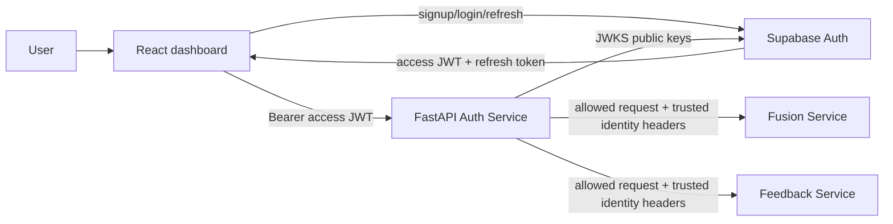

# Milestone 6 TDD: Supabase Authentication and FastAPI RBAC Gateway

## 1. Architecture

Auth Service port `8005` public dashboard API gateway hai. Fusion `8001` and Feedback `8002` Docker internal network par hain. Sensor/video/MQTT machine traffic is user authentication path ka part nahi hai.

## 2. Token rules

React `@supabase/supabase-js` use karta hai. Access JWT API header mein aata hai. Refresh token Supabase SDK ke session storage/refresh flow tak limited hai.

Backend `PyJWT` and Supabase JWKS endpoint use karke asymmetric `RS256`/`ES256` signature verify karta hai. Required checks:

- algorithm allow-list;
- signature and key ID;
- exact issuer `<SUPABASE_URL>/auth/v1`;
- audience (default `authenticated`);
- `exp`, `iat`, `sub`, `session_id`;
- custom `user_role` allow-list.

JWKS client limited caching use karta hai. Private signing key/JWT secret application ko nahi diya jata.

## 3. RBAC enforcement

Gateway default-deny matrix:

| Action | pending | caregiver | doctor | admin |
|---|---:|---:|---:|---:|
| Read status/history/events/trends/feedback | No | Yes | Yes | Yes |
| Generate feedback/summary | No | Yes | Yes | Yes |
| Acknowledge event | No | Yes | No | Yes |
| Assign roles | No | No | No | Yes |
| Live WebSocket | No | Yes | Yes | Yes |

Authentication failure returns 401 with Bearer challenge. Valid identity without permission returns 403. Upstream outage returns sanitized 503.

## 4. Supabase data design

`public.user_roles` stores one role per `auth.users.id`. Auth-user insert trigger creates `pending`. Custom Access Token Hook reads this table and adds `user_role` before JWT issue. `role_audit_log` records old/new role, actor and timestamp.

RLS is enabled and grants are revoked from `anon` and `authenticated`. Hook access is granted only to `supabase_auth_admin`; administration uses a backend-only service-role key.

## 5. REST endpoints

| Method/path | Authentication | Purpose |
|---|---|---|
| `GET /health` | No | Container health; no secret/network call |
| `GET /api/auth/config` | No | Browser-safe Supabase URL/publishable key |
| `GET /api/auth/me` | Any valid role | Verified identity and current claim |
| `POST /api/auth/ws-ticket` | caregiver/doctor/admin | One-time 30-second live-connection ticket |
| `PUT /api/admin/users/{uuid}/role` | admin | Upsert role through Supabase REST |
| `/api/*` | Matrix | Forward allowed request to Fusion or Feedback |

Gateway strips hop-by-hop, Authorization and incoming trusted-identity headers. It adds verified `X-HAR-User-ID` and `X-HAR-User-Role` internally.

## 6. WebSocket design

Browser WebSocket API custom Authorization header set nahi karta. JWT query string mein rakhne se access logs leak ho sakte hain. Isliye React authenticated REST call se target-specific ticket leta hai. Ticket HMAC-signed, short-lived and one-time hai. Gateway consume karne ke baad upstream `/ws` bridge open karta hai.

Current ticket replay store process memory mein hai. Multiple auth replicas deploy karne se pehle shared Redis/DB nonce store required hoga.

## 7. Configuration

Required: `SUPABASE_URL`, `SUPABASE_PUBLISHABLE_KEY`, `AUTH_TICKET_SECRET` (32+ characters). Admin role API ke liye `SUPABASE_SERVICE_ROLE_KEY` required hai. Optional settings audience, algorithm list, ticket TTL, upstream timeout and internal URLs control karte hain.

## 8. Failure and security behaviour

- Unknown JWKS key triggers safe key refresh; invalid token remains 401.
- Supabase login unavailable ho to existing unexpired JWT local verification continue kar sakta hai while cached key trusted hai.
- Role change existing JWT ko mutate nahi karta; refresh/new login required hai.
- Logout ke baad already issued access JWT expiry tak cryptographically valid ho sakta hai. Highly sensitive future actions session introspection add kar sakte hain.
- No token/password/key is logged.
- Auth Service is the only public REST/WebSocket backend in secured Compose mode.

## 9. Tests

Unit tests claim verification adapter, permission matrix and ticket tamper/expiry/replay cover karte hain. ASGI tests 401/403, proxy routing, identity-header replacement, admin protection and sanitized upstream errors cover karte hain. React build/type checks login/session/API token integration validate karte hain.
